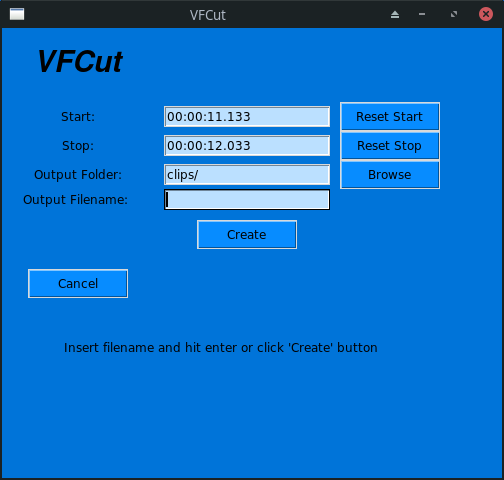

# VFCut - cut videos from mpv with a shortcut
VFCut is a small tool that helps you to save clips from mpv with a simple keyboard shortcut.
This was done to improve the process of creating small clips and storing them live while watching a footage in mpv.
VFCut uses [ffmpeg](https://github.com/FFmpeg/FFmpeg) to cut the video in background processes.

## Getting Started

### Prerequisites
1. Install the [mpv](https://github.com/mpv-player/mpv) video player

2. [ffmpeg](https://github.com/FFmpeg/FFmpeg)

3. Python3 + Tk (as it uses tkinter)

Ubuntu: `sudo pacman -Sy tk`

Arch: `sudo pacman -Sy tk`

### Installing

1. clone or download the repo

`git clone git@github.com:Laeri/vfcut.git`

2. cd into the folder

`cd vfcut`

3. run ./install (just copies the python file into /usr/bin

`./install`

./install also creates ~/.config/mpv/input.conf if it does not exist.

If it exists it appends the shortcut:

`t run "vfcut" "-t ${playback-time}" "-i ${path}"; pause cycle`
You could also add this shortcut yourself.

## Usage
### MPV
1. Watch the video with the [mpv](https://github.com/mpv-player/mpv) player
2. Press <kbd>t</kbd> once when the clip should start
3. Press <kbd>t</kbd> again when the clip should end
4. A window opens up where you can type the filename output
5. Additionally you can also change the output folder (defaults to clips/)
6. Press <kbd>Enter</kbd> or click the <kbd>Create</kbd> button and the clip is automatically created in the background
### CLI
You can also call 'vfcut' from the cli.

Type `vfcut -h` or `vfcut --help` to see the help text.
### Keybindings
Use when running mpv, change this by modifying ~/.config/mpv/input.conf

<kbd>t</kbd> - set start or stop time of the clip

## License
This project is licensed under the MIT License - see the [LICENSE.md](LICENSE.md) file
for details.
